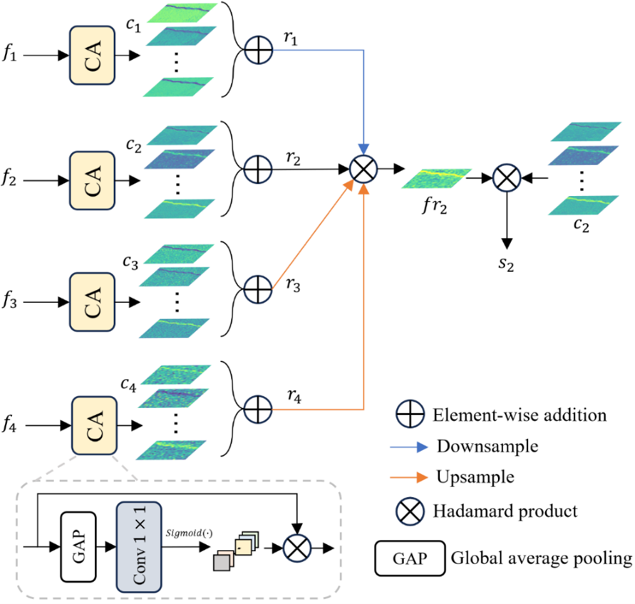

# SER: A semantics-enhanced refiner 

This manuscript presents a semantics-enhanced refiner for enhancing the detailed texture and global semantic information of image features.

<div align=center>

</div>

More details will be provided in the [paper](https://doi.org/10.1007/978-981-97-5603-2_7).

If you feel that our work has been helpful to you, or will adopt it in your work, please cite us:
```
@InProceedings{10.1007/978-981-97-5603-2_7,
author="Zeng, Zhigao and Wang, Jin and Cao, Wei and Wang, Jianxin and Zhang, Jianming",
editor="Huang, De-Shuang and Chen, Wei and Pan, Yijie",
title="Semantics-Enhanced Refiner in Skip Connection for Crack Segmentation",
booktitle="Advanced Intelligent Computing Technology and Applications",
year="2024",
publisher="Springer Nature Singapore",
address="Singapore",
pages="81--92",
isbn="978-981-97-5603-2",
DOI="10.1007/978-981-97-5603-2_7"
}
```
